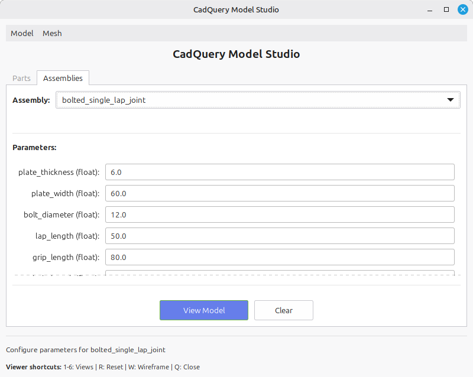
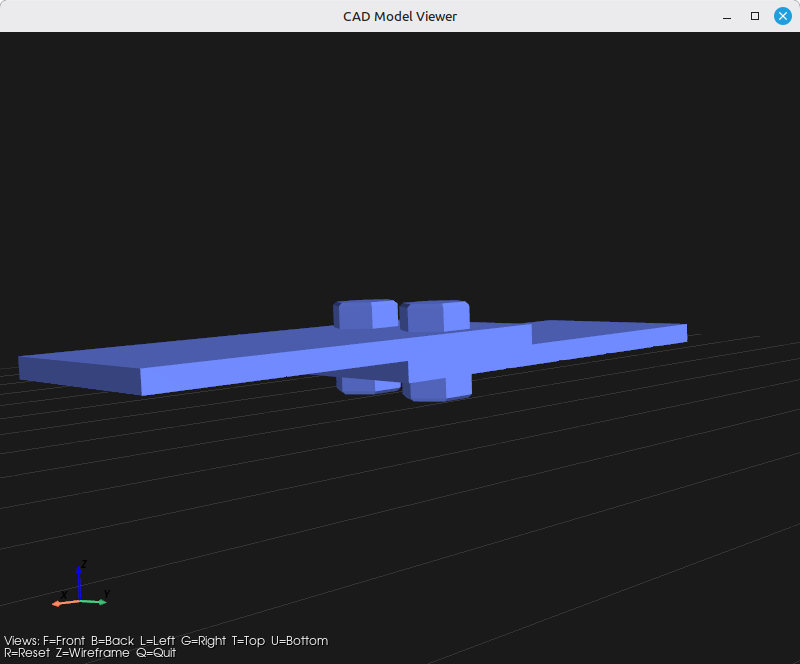
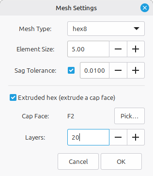
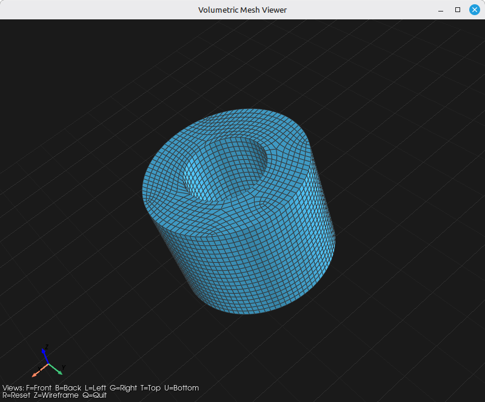

# CadQuery Model Studio

A Python application for building parametric CAD parts and assemblies with
[CadQuery](https://github.com/CadQuery/cadquery), exporting them to STEP and
to a custom `CADModelData` JSON format, and visualizing the results in a
PyVista-based viewer.

The `CADModelData` JSON envelope is the wire format consumed by a sibling C#
application (`RSA.Model.CADModelData`); the schemas are kept in sync so the
two sides interoperate.

## Features

- **Parametric parts.** Drop a Python function into `app/models/parts/` and it
  becomes available everywhere — GUI, CLI, and assembly YAML — via auto-discovery.
- **Declarative YAML assemblies and parametric Python assemblies.** Describe an
  assembly as a list of part instances with parameters and per-instance transforms
  in YAML, or author a Python assembly that computes derived placements in code
  (e.g. `bolted_single_lap_joint`). Both are auto-discovered.
- **STEP and CADModelData export.** STEP is a passthrough to cadquery's native
  writers. JSON export goes through a `CadQuery → CADModelData` converter that
  walks topology, tessellates faces, and builds the multi-model envelope used by
  the C# consumer.
- **STEP import with assembly hierarchy.** Read a STEP file back into a
  `CADModelData` envelope with component names and per-instance transforms
  recovered from the STEP product structure.
- **Identity-based deduplication.** A shape used multiple times in an assembly
  produces a single PART entry referenced by multiple `Component`s.
- **GTK GUI and four CLIs**, all sharing the same converter / exporter / mesher /
  viewer pipeline. The GUI has Parts and Assemblies tabs and face picking in the
  viewer for tagging mesh entity owners.
- **Volumetric meshing** via Gmsh — tet/hex elements (`tet4`/`tet10`/`hex8`/
  `hex20`/`hex27`), optional curvature-driven refinement via `relativeSagTolerance`
  (max sag/radius on curved faces), and export to the `MeshData` wire format
  (XML or JSON), legacy mesh JSON, or native Gmsh `.msh`.
- **Structured extruded hex8.** For prismatic parts, name a planar cap face and
  the mesher quad-meshes it and sweeps that mesh through the part thickness in
  `numLayers` explicit layers, yielding a clean all-hex mesh with boundary
  edges/faces and entity containers classified onto the original solid. Hex
  meshes are validated and rejected if any element is inverted.
- **MeshData export.** Volumetric meshes serialize to a versioned `MeshData`
  envelope (one `MeshFragment` per Part, boundary edges/faces, and entity
  containers) consumed by the sibling C# `RSA.Mesh` application.

## Requirements

This project depends on a stack that is easiest to install via conda:

- [`cadquery`](https://github.com/CadQuery/cadquery) (uses OCP / OpenCascade)
- [`freecad`](https://www.freecad.org) (used internally for face tessellation
  and topology walking — invoked via its Python API, not the GUI)
- [`pyvista`](https://github.com/pyvista/pyvista) for the 3D viewer
- [`gmsh`](https://gmsh.info) for volumetric meshing
- `PyYAML` for YAML assembly specs
- GTK 3 (system package) for the GUI

The expected setup is a single conda environment with all of the above
co-installed:

```bash
conda create -n cadquery -c conda-forge cadquery freecad pyvista gmsh pyyaml
conda activate cadquery
```

GTK 3 is a system dependency on Linux (`apt install libgtk-3-0` on Debian/Ubuntu
or equivalent). On macOS / Windows you'll need a working GTK 3 install for the
GUI; the CLIs work without it.

All scripts in this repo expect the conda environment to be active.

## Quick start

All commands are run from `app/`:

```bash
cd app
```

### Build a part interactively (GUI)

```bash
python cad_app.py
```

Pick a model from the dropdown (e.g. `box`, `hex_bolt`, `bracket`, or
`thick_tube` — a hollow tube that can be restricted to an angular sector via
`sweep_angle_deg` for modeling a quarter under symmetric loads), set its
parameters, and use **Model → View** to render it or **Model → Export** to
write a STEP or `CADModelData` JSON file.

### Build an assembly from a YAML spec

```bash
python build_assembly.py models/assemblies/bolted_plate.yaml -o bolted_plate.json
python build_assembly.py models/assemblies/bolted_plate.yaml -o bolted_plate.step
python build_assembly.py models/assemblies/bolted_plate.yaml --view
```

A minimal `models/assemblies/*.yaml` looks like this:

```yaml
name: bolted_plate
units: mm
instances:
  - id: plate
    part: box
    params: { boxx: 40, boxy: 40, boxz: 5 }
    location: { translate: [0, 0, 0], rotate: [0, 0, 0] }
  - id: bolt
    part: hex_bolt
    params: { diameter: 6, length: 20, head_width: 10, head_height: 4 }
    location: { translate: [0, 0, 2.5], rotate: [0, 0, 0] }
  - id: nut
    part: hex_nut
    params: { across_flats: 10, thickness: 5, hole_diameter: 6 }
    location: { translate: [0, 0, -7.5], rotate: [0, 0, 0] }
```

### Convert a STEP file to CADModelData JSON

```bash
python step_to_cadmodeldata.py input.step
python step_to_cadmodeldata.py input.step -o output.json
python step_to_cadmodeldata.py input.step --name my_part
```

If the STEP file contains assembly structure, the output is a multi-model
envelope with component names and per-instance transforms recovered from the
STEP product hierarchy. Single-shape STEPs produce a one-PART envelope.

### Mesh a STEP file from the CLI

```bash
python mesh_step_model.py input.step mesh_config.yaml
python mesh_step_model.py input.step mesh_config.yaml -o output.json
python mesh_step_model.py input.step mesh_config.yaml --name my_part
```

Mesh controls and output format come from a YAML config:

```yaml
mesh:
  elementType: tet4             # tet4, tet10, hex8, hex20, hex27
  elementSize: 5.0
  relativeSagTolerance: 0.01    # optional; max sag/radius on curved faces

output:
  format: xml                   # xml, json (MeshData formats), or msh
```

For a prismatic part, add a `mesh.extrusion` block to build a structured
all-hex mesh swept from a cap face (requires `elementType: hex8`):

```yaml
mesh:
  elementType: hex8
  elementSize: 5.0
  extrusion:
    capFace: F4                 # PersistentID of the planar cap face to sweep
    numLayers: 8                # hex layers through the thickness
```

### Visualize a model or mesh

```bash
python visualize.py model.json    # CADModelData (envelope or flat)
python visualize.py part.step     # STEP file (assembly hierarchy preserved)
python visualize.py mesh.xml      # MeshData XML (volumetric)
python visualize.py mesh.json     # MeshData JSON or legacy mesh JSON
python visualize.py mesh.msh      # Gmsh volumetric mesh
python visualize.py               # opens a file picker
```

## Screenshots

### Model Studio (GUI)

Use the **Parts** tab to pick a part, or the **Assemblies** tab to pick an
assembly; set its parameters, then view or export it.




### Rendered model

The PyVista viewer used by **Model → View** and `visualize.py`.




### Volumetric meshing

**Mesh → Create Mesh** generates a volumetric mesh via Gmsh and displays it
in the same viewer; statistics are available from **Mesh → Show Stats**.
#### Mesh Settings

#### Mesh Settings with Extrusion

#### Mesh of Parametric Gear

#### Mesh of Cylinder with Holes

#### Extruded Mesh of Thick Tube

#### Mesh Statistics


## Project layout

```
app/
  cad_app.py                # GTK GUI entry point
  build_assembly.py         # CLI: YAML assembly → STEP / CADModelData
  step_to_cadmodeldata.py   # CLI: STEP file → CADModelData JSON
  mesh_step_model.py        # CLI: STEP file + YAML config → MeshData / .msh
  visualize.py              # CLI: open viewer for any supported format
  assembly.py               # YAML assembly loader

  models/
    parts/                  # auto-discovered part functions (box, hex_bolt, ...)
    assemblies/             # parametric Python assemblies + static YAML specs
    common/                 # shared helpers (placeholder)
  model/                    # CADModelData dataclass (mirrors C# schema)

  importer/                 # file → CadQuery objects
    step_importer.py        #   STEP file → cq.Assembly | cq.Workplane
  converter/                # CadQuery objects → CADModelData
    converter.py            #   part_to_modeldata, assembly_to_modeldata,
                            #   step_model_to_cadmodeldata, to_modeldata
    _freecad.py             #   private FreeCAD-bound geometry walker
  exporter/                 # CadQuery / CADModelData → files
    step_exporter.py        #   passthrough to cadquery's native STEP writers
    cadmodeldata_exporter.py#   write CADModelData envelope JSON

  viewer/                   # PyVista viewer
  mesher/                   # Gmsh volumetric mesh generation
    gmsh_mesher.py          #   mesh generation + curvature refinement
    meshdata_reader.py      #   MeshData JSON/XML → PyVista
    export/                 #   MeshData collection + XML/JSON exporters
  widgets/                  # GTK widgets (model builder, etc.)
  dialogs/                  # GTK file/settings dialogs
```

## CADModelData JSON format

`CADModelData` is a tree of CAD model entries (one per Part or Assembly) with
shared topology, mass properties, parameters, and assembly child references.
The Python writer emits the envelope format produced by the C# `CADModelDataWriter`:

```json
{
  "rootIndex": 0,
  "models": [
    {
      "cadName": "CadQuery",
      "modelName": "bolted_plate",
      "modelTypeValue": "ASSEMBLY",
      "childComponents": [
        { "transformToParent": [16 doubles], "childIndex": 1 },
        { "transformToParent": [16 doubles], "childIndex": 2 }
      ]
    },
    { "modelTypeValue": "PART", "vertexList": [...], "edgeList": [...], "faceList": [...] },
    ...
  ]
}
```

Each PART entry holds its own topology in its local frame. The `childComponents`
on an ASSEMBLY hold per-instance placements (4×4 row-major affine matrices) and
integer references into the flat `models` array — so a shape used N times
appears once and is referenced N times.

Property names are camelCase. `modelTypeValue` is the enum name string
(`"PART"` / `"ASSEMBLY"`) for readability. The C# reader is configured with
`PropertyNameCaseInsensitive = true` and `JsonStringEnumConverter`, so the
envelope round-trips between the Python writer and C# reader.

## MeshData format

Volumetric meshes serialize to a separate `MeshData` wire format, available in
both JSON and XML and consumed by the sibling C# `RSA.Mesh` application. Every
file is stamped with a schema identifier and version (`schema: "rsa.mesh"`,
`version: 1`) so readers can discriminate layout changes:

```json
{
  "schema": "rsa.mesh",
  "version": 1,
  "id": "mesh",
  "owner": "model",
  "nodes": [ { "id": 1, "location": [0.0, 0.0, 0.0] }, ... ],
  "fragments": [
    {
      "elementType": "Tet4",
      "owner": "plate",
      "elements": [ { "id": 1, "nodes": [1, 2, 3, 4] }, ... ]
    },
    ...
  ],
  "boundaryEdges": [ ... ],
  "boundaryFaces": [ ... ],
  "meshEntityContainers": [ ... ]
}
```

A mesh is split into one `MeshFragment` per Part, each tagged with the element
type (PascalCase, matching the C# `ElementType` enum — `Tet4`, `Hex8`, `Tet10`,
`Hex20`, `Hex27`, `Wedge6`, `Pyramid5`) and an `owner`. Boundary edges/faces and
mesh entity containers are emitted alongside the fragments; the `owner` and
entity owners come from the mesh config (and from viewer face picking in the
GUI). The XML format carries the same data under a `<Mesh>` root.

## License

This project is licensed under the MIT License — see [LICENSE](LICENSE) for details.
