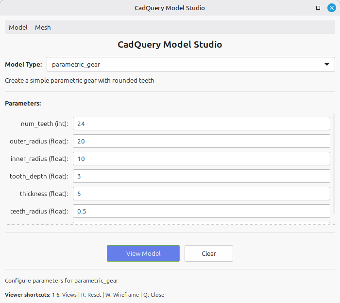
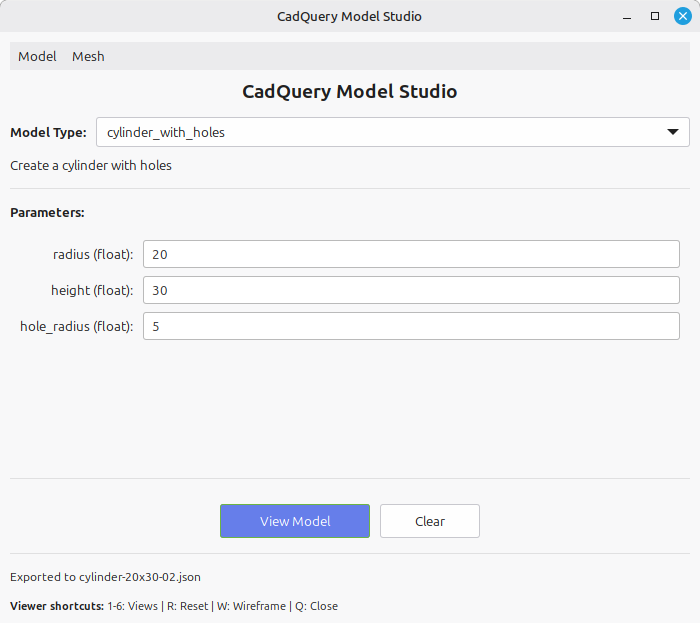
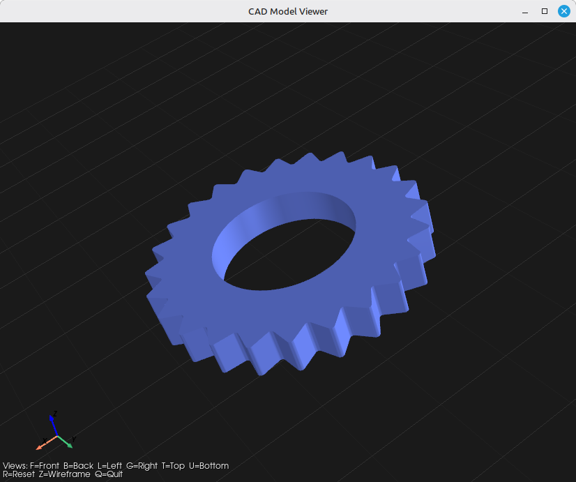
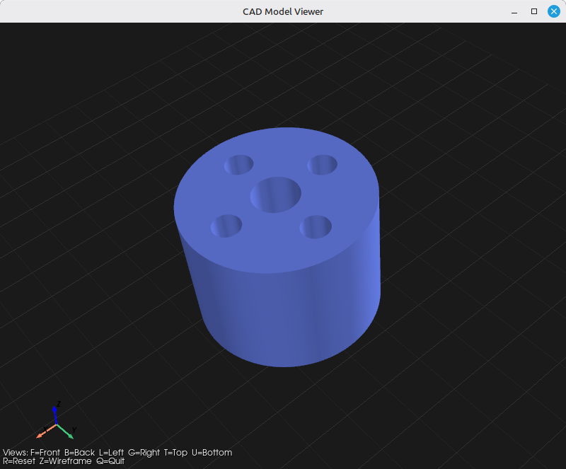
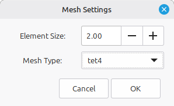
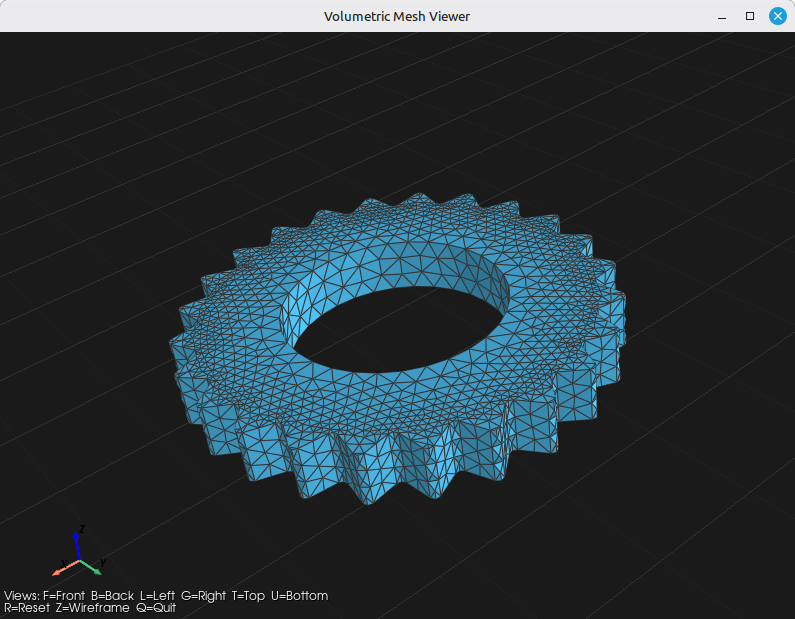
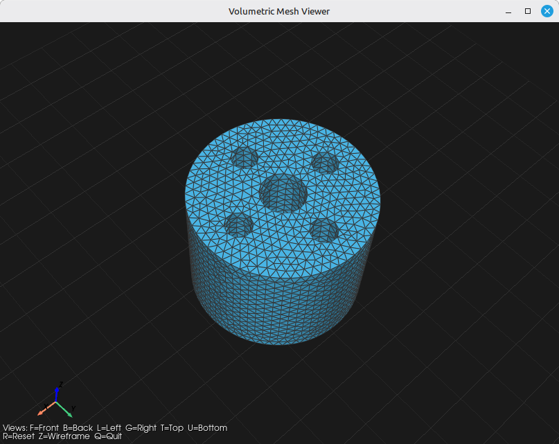
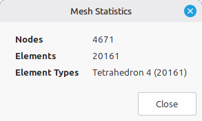

# CadQuery Model Studio

A Python application for building parametric CAD parts and assemblies with
[CadQuery](https://github.com/CadQuery/cadquery), exporting them to STEP and
to a custom `CADModelData` JSON format, and visualizing the results in a
PyVista-based viewer.

The `CADModelData` JSON envelope is the wire format consumed by a sibling C#
application (`RSA.Model.CADModelData`); the schemas are kept in sync so the
two sides interoperate.

## Features

- **Parametric parts.** Drop a Python function into `app/models/` and it
  becomes available everywhere — GUI, CLI, and assembly YAML — via auto-discovery.
- **Declarative YAML assemblies.** Describe an assembly as a list of part
  instances with parameters and per-instance transforms; the loader instantiates
  each part and places it.
- **STEP and CADModelData export.** STEP is a passthrough to cadquery's native
  writers. JSON export goes through a `CadQuery → CADModelData` converter that
  walks topology, tessellates faces, and builds the multi-model envelope used by
  the C# consumer.
- **STEP import with assembly hierarchy.** Read a STEP file back into a
  `CADModelData` envelope with component names and per-instance transforms
  recovered from the STEP product structure.
- **Identity-based deduplication.** A shape used multiple times in an assembly
  produces a single PART entry referenced by multiple `Component`s.
- **GTK GUI and three CLIs**, all sharing the same converter / exporter / viewer
  pipeline.
- **Optional volumetric meshing** via Gmsh (tet/hex elements, mesh JSON export).

## Requirements

This project depends on a stack that is easiest to install via conda:

- [`cadquery`](https://github.com/CadQuery/cadquery) (uses OCP / OpenCascade)
- [`freecad`](https://www.freecad.org) (used internally for face tessellation
  and topology walking — invoked via its Python API, not the GUI)
- [`pyvista`](https://github.com/pyvista/pyvista) for the 3D viewer
- [`gmsh`](https://gmsh.info) for volumetric meshing
- `PyYAML` for YAML assembly specs
- GTK 3 (system package) for the GUI

The expected setup is a single conda environment with all of the above
co-installed:

```bash
conda create -n cadquery -c conda-forge cadquery freecad pyvista gmsh pyyaml
conda activate cadquery
```

GTK 3 is a system dependency on Linux (`apt install libgtk-3-0` on Debian/Ubuntu
or equivalent). On macOS / Windows you'll need a working GTK 3 install for the
GUI; the CLIs work without it.

All scripts in this repo expect the conda environment to be active.

## Quick start

All commands are run from `app/`:

```bash
cd app
```

### Build a part interactively (GUI)

```bash
python cad_app.py
```

Pick a model from the dropdown (e.g. `box`, `hex_bolt`, `bracket`), set its
parameters, and use **Model → View** to render it or **Model → Export** to
write a STEP or `CADModelData` JSON file.

### Build an assembly from a YAML spec

```bash
python build_assembly.py assemblies/bolted_plate.yaml -o bolted_plate.json
python build_assembly.py assemblies/bolted_plate.yaml -o bolted_plate.step
python build_assembly.py assemblies/bolted_plate.yaml --view
```

A minimal `assemblies/*.yaml` looks like this:

```yaml
name: bolted_plate
units: mm
instances:
  - id: plate
    part: box
    params: { boxx: 40, boxy: 40, boxz: 5 }
    location: { translate: [0, 0, 0], rotate: [0, 0, 0] }
  - id: bolt
    part: hex_bolt
    params: { diameter: 6, length: 20, head_width: 10, head_height: 4 }
    location: { translate: [0, 0, 2.5], rotate: [0, 0, 0] }
  - id: nut
    part: hex_nut
    params: { across_flats: 10, thickness: 5, hole_diameter: 6 }
    location: { translate: [0, 0, -7.5], rotate: [0, 0, 0] }
```

### Convert a STEP file to CADModelData JSON

```bash
python step_to_cadmodeldata.py input.step
python step_to_cadmodeldata.py input.step -o output.json
python step_to_cadmodeldata.py input.step --name my_part
```

If the STEP file contains assembly structure, the output is a multi-model
envelope with component names and per-instance transforms recovered from the
STEP product hierarchy. Single-shape STEPs produce a one-PART envelope.

### Visualize a model or mesh

```bash
python visualize.py model.json    # CADModelData (envelope or flat)
python visualize.py part.step     # STEP file (assembly hierarchy preserved)
python visualize.py mesh.msh      # Gmsh volumetric mesh
python visualize.py mesh.json     # mesh JSON
python visualize.py               # opens a file picker
```

## Screenshots

### Model Studio (GUI)

Pick a model from the dropdown, set its parameters, and view or export it.




### Rendered model

The PyVista viewer used by **Model → View** and `visualize.py`.




### Volumetric meshing

**Mesh → Create Mesh** generates a volumetric mesh via Gmsh and displays it
in the same viewer; statistics are available from **Mesh → Show Stats**.






## Project layout

```
app/
  cad_app.py                # GTK GUI entry point
  build_assembly.py         # CLI: YAML assembly → STEP / CADModelData
  step_to_cadmodeldata.py   # CLI: STEP file → CADModelData JSON
  visualize.py              # CLI: open viewer for any supported format
  assembly.py               # YAML assembly loader
  assemblies/               # sample YAML assembly specs

  models/                   # auto-discovered part functions (box, hex_bolt, ...)
  model/                    # CADModelData dataclass (mirrors C# schema)

  importer/                 # file → CadQuery objects
    step_importer.py        #   STEP file → cq.Assembly | cq.Workplane
  converter/                # CadQuery objects → CADModelData
    converter.py            #   part_to_modeldata, assembly_to_modeldata,
                            #   step_model_to_cadmodeldata, to_modeldata
    _freecad.py             #   private FreeCAD-bound geometry walker
  exporter/                 # CadQuery / CADModelData → files
    step_exporter.py        #   passthrough to cadquery's native STEP writers
    cadmodeldata_exporter.py#   write CADModelData envelope JSON

  viewer/                   # PyVista viewer
  mesher/                   # Gmsh volumetric mesh generation
  widgets/                  # GTK widgets (model builder, etc.)
  dialogs/                  # GTK file/settings dialogs
```

## CADModelData JSON format

`CADModelData` is a tree of CAD model entries (one per Part or Assembly) with
shared topology, mass properties, parameters, and assembly child references.
The Python writer emits the envelope format produced by the C# `CADModelDataWriter`:

```json
{
  "rootIndex": 0,
  "models": [
    {
      "cadName": "CadQuery",
      "modelName": "bolted_plate",
      "modelTypeValue": "ASSEMBLY",
      "childComponents": [
        { "transformToParent": [16 doubles], "childIndex": 1 },
        { "transformToParent": [16 doubles], "childIndex": 2 }
      ]
    },
    { "modelTypeValue": "PART", "vertexList": [...], "edgeList": [...], "faceList": [...] },
    ...
  ]
}
```

Each PART entry holds its own topology in its local frame. The `childComponents`
on an ASSEMBLY hold per-instance placements (4×4 row-major affine matrices) and
integer references into the flat `models` array — so a shape used N times
appears once and is referenced N times.

Property names are camelCase. `modelTypeValue` is the enum name string
(`"PART"` / `"ASSEMBLY"`) for readability. The C# reader is configured with
`PropertyNameCaseInsensitive = true` and `JsonStringEnumConverter`, so the
envelope round-trips between the Python writer and C# reader.

## License

This project is licensed under the MIT License — see [LICENSE](LICENSE) for details.
