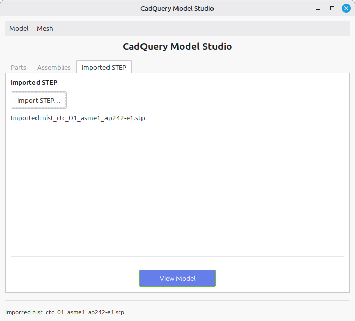
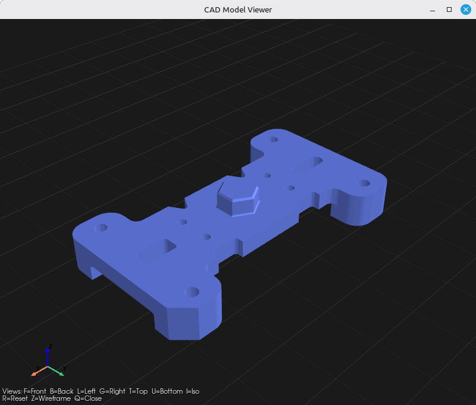
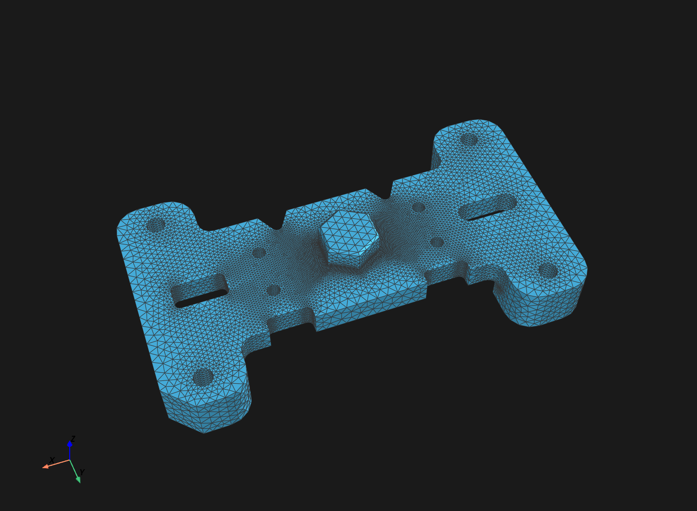
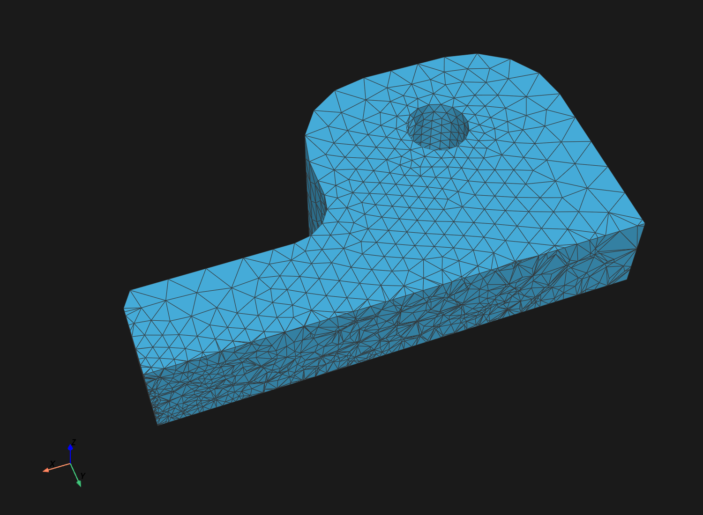
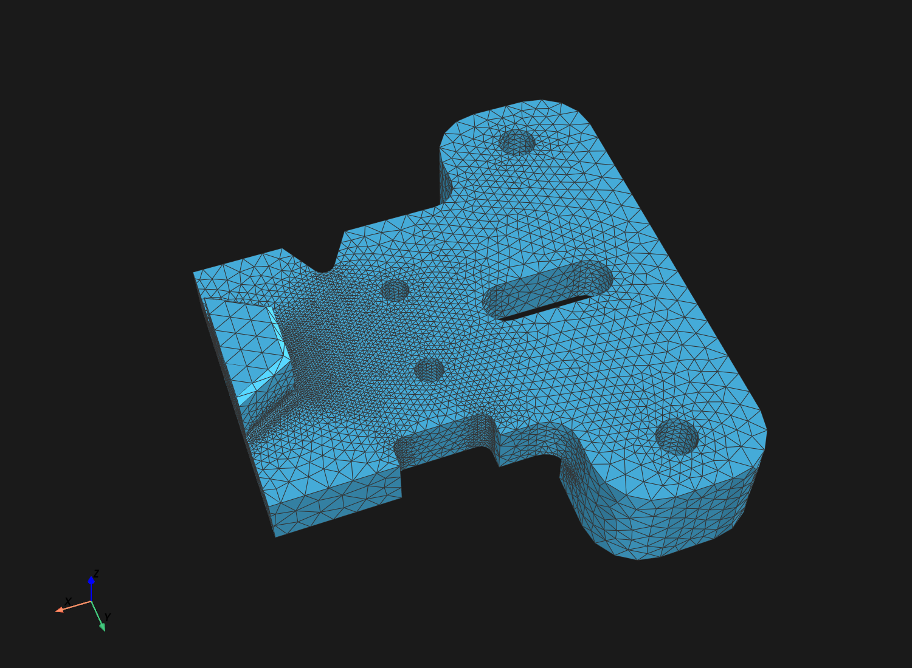
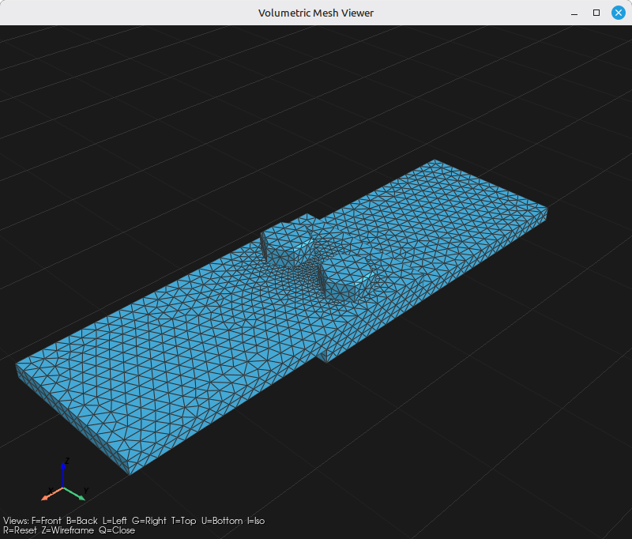
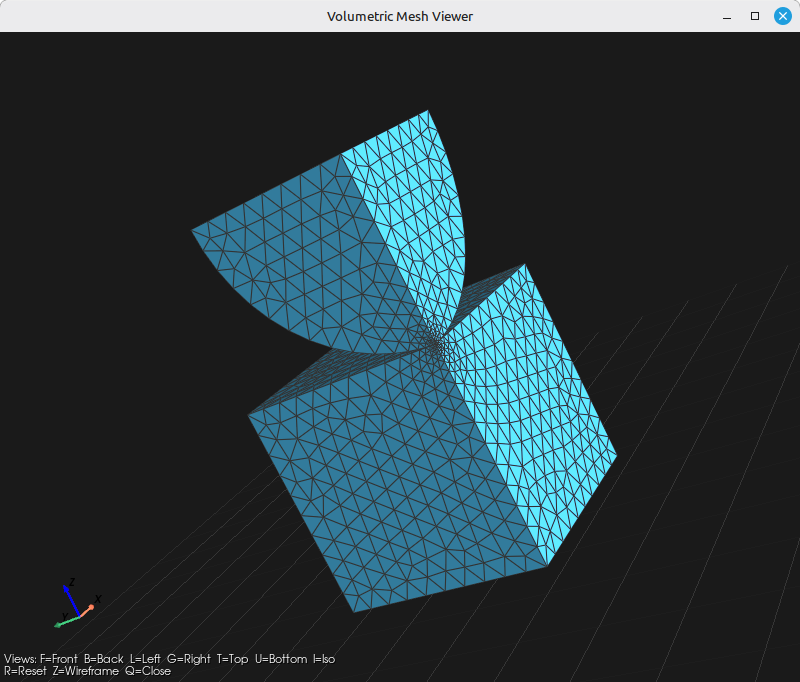

# CadQuery Model Studio — Showcase

**External STEP in, good mesh out.** Build a parametric model (or import a STEP
from *any* CAD tool), pick the faces and vertices that matter, and generate a
clean tet or structured-hex mesh with the entity references preserved — so a
boundary condition lands on the *right* face regardless of which tool wrote the
STEP.

---

## The studio

A three-tab workspace — **Parts**, **Assemblies**, and **Imported STEP** — that all
behave the same: view in 3D, pick entities, mesh, save, export.


---

## 1. Source-agnostic entity identity — the headline

Mesh controls and results attach to specific CAD entities: a face named as a
boundary-condition surface, a cap face for extrusion, a vertex anchoring local
refinement. The hard part is making a *reference* mean the same entity in the
generated mesh — even though meshing reorders, renumbers, merges, or splits the
CAD entities, and even though the STEP may come from a foreign tool.

This app resolves entities **by their geometry**, never by tool-specific
numbering. The same reference resolves correctly whether the model was built
in-app or imported as an external STEP — and coincident entities (two parts
touching at a contact point) are told apart by their owning part.


*Pick a contact face on the bolted joint, then reference the same face on an
equivalent foreign STEP — both resolve to the same mesh entity.*

---

## 2. Imported STEP — a foreign part, meshed

The **Imported STEP** tab takes a STEP file from *any* CAD system and treats it
exactly like a built model — view, pick, mesh, save, export. Here a NIST PMI
reference part (AP242), never authored by this app, is imported and viewed in the
studio:

| Import the STEP | View the geometry |
|---|---|
|  |  |

…then tet-meshed with curvature-driven **sag** refinement — the mesh densifies
around every hole and fillet while flat regions stay coarse:

| Whole part, meshed | Mesh detail — sag refinement at a hole |
|---|---|
|  |  |

A cut-through confirms it's a full volume mesh, with refinement hugging the
curved features throughout:



This is the app's target use case: *external STEP in, good mesh out.*

---

## 3. Structured hex from a cap face

Pick a flat **cap face** and the mesher quad-meshes it and sweeps it through the
thickness as explicit hex layers landing exactly on the opposite face — instead
of the catch-all subdivision fallback. The result is dramatically smaller *and*
higher quality:

| Method | Elements (10×20×30 box @ size 2.5) | Min scaled Jacobian (gmsh `minSICN`) |
|---|---:|---:|
| Subdivision hex8 (fallback) | 8080 | ~0.56 |
| **Extruded hex8 (cap face)** | **384** (≈21× fewer) | **1.00** |

*Figures from the project's own validation runs.*

Curved cap edges (holes, fillets) stay faithful via a local sag-tolerance field,
and an inverted-element **validity gate** refuses to ship a non-physical mesh.

| Create Mesh ▸ Extruded Hex tab | Extruded hex mesh (thick tube) |
|---|---|
|  |  |

---

## 4. From model to mesh

| Model | Mesh |
|---|---|
|  |  |
|  |  |
|  |  |

The bolted joint is a multi-part assembly: the mesher emits one element fragment
per part, and entities shared at an interface (e.g. the two plates' contact
faces) are kept distinct per body.

---

## 5. Mesh controls & statistics

The **Create Mesh** dialog organizes settings into tabs: **General** (element
type — tet4 / tet10 / hex8 / hex20 / hex27 — target size, and curvature-driven
`relativeSagTolerance`), **Refinement** (local/contact refinement anchored at
picked vertices), and **Extruded Hex** (cap face + layers). Mesh statistics are
reported after generation.

Local/contact refinement concentrates elements exactly where they matter — here a
sphere-on-block (quarter-symmetry) Hertzian contact, with the mesh densifying at
the contact point and relaxing back to the global size away from it:



| Create Mesh dialog | Mesh statistics |
|---|---|
|  |  |

---

## 6. Headless / scriptable

The same core runs without a GUI. Enumerate a foreign STEP's entities, reference
them in a YAML config, and mesh — ideal for CI or batch runs.

```bash
# Discover the entities of any STEP (geometry-described, in the model's own units)
python mesh_step_model.py model.step --list-entities

# Mesh it with a config (owners become named node/element sets in the output)
python mesh_step_model.py model.step mesh_config.yaml
```

```yaml
# mesh_config.yaml
mesh:
  elementType: tet4
  elementSize: 5.0
  relativeSagTolerance: 0.01

output:
  format: xml

# Reference entities by geometry (centroids from --list-entities), never by
# tool-specific numbering — so the same config resolves on a STEP from any source.
owners:
  - { owner: "Fixed Face", kind: face,   at: [60.0, 0.0, 12.5] }
  - { owner: "Load Point", kind: vertex, at: [0.0, 50.0, 25.0] }
```

Output is a portable MeshData file (JSON or XML): nodes, per-part element
fragments, boundary faces/edges, and `MeshEntityContainers` (the node/element
sets your solver attaches conditions to).

---

## 7. Model library

Parametric builders ship in-app, so the whole pipeline is demoable without any
external file:

**Parts**

- `box`
- `box_with_rounded_edges_and_hole`
- `bracket`
- `complex_part`
- `cylinder`
- `cylinder_with_holes`
- `double_headed_hex_bolt`
- `hemisphere_sector`
- `hex_bolt`
- `hex_nut`
- `lifting_lug`
- `loft`
- `parametric_gear`
- `plate_with_hole`
- `tapered_cut`
- `thick_tube`

**Assemblies**

- `bolted_single_lap_joint`
- `hertzian_sphere_on_block_quarter_symmetry`

…or import your own STEP and treat it exactly like a built model.
